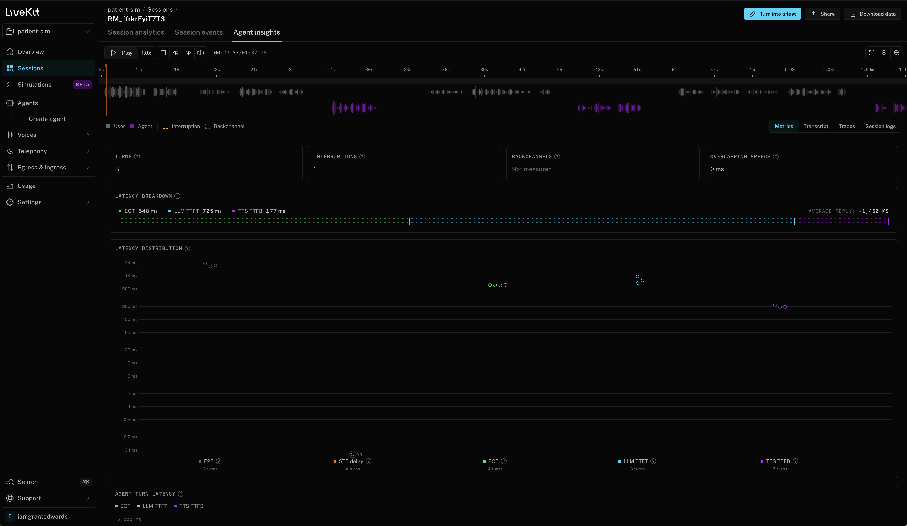

# LiveKit Cloud verification — September 19, 2026

Call: `call-20260918-231955-765427d8`  
Cloud session: `RM_ffrkrFyiT7T3`

## What was observed

Codex inspected the authenticated LiveKit Cloud console on September 19, 2026.
Session analytics showed the room name matching this call ID, session
`RM_ffrkrFyiT7T3`, a CLOSED session, and two participants (SIP and agent).
Agent insights displayed audio playback controls, both waveform lanes and metrics.
Grant supplied the screenshot below at 12:27 PM America/Los_Angeles.
The room-name match was checked separately in Session analytics; the screenshot
shows the session ID, not the local call ID.

The image is the original user-supplied capture, copied without edits. Visual review
found no credentials, contact details or transcript text. It includes the public
account handle iamgrantedwards and the project name patient-sim.
Screenshot SHA-256: `791a3e4c4bd6551ce73294c4897f9080b476c54298d7685a735f32858a08b676`.

## What this does not establish

This is a dated console observation, not a live health check or an independent audit.
The Cloud player was visible; its audio was not played end to end during this check.
Completeness, intelligibility, both audible sides, and agreement with the local
recording/transcript still require listening. No call is accepted by this record.
The selected call's human listening review remains pending.

The Cloud timeline displays 01:37.06. The preserved local OGG probes at about
70.29 seconds. Those values have not been reconciled and must not be described
as proof of identical audio. Cloud metrics are provider-reported; they do not
replace our pending measurements from local audio offsets.

## Storage and reproducibility

The worker runs locally and connects to LiveKit Cloud. This confirms a Cloud session
and observability interface, not deployment of the worker to Cloud hosting.
The original audio and transcript remain local under `calls/call-20260918-231955-765427d8/`.
This public screenshot and note are separate, additive evidence, packaged with the
read-only viewer. Opening them needs no LiveKit account and makes no provider request.
No API key, authenticated share link, recording upload or original artifact edit
is included in this change. Cloud retention and future availability are not promised.

## Adding a later check

Inspect that call's own Cloud room/session and capture its evidence. Add a separately
reviewed folder keyed to its call ID, with verification.json, verification.md and
cloud.png. The JSON records the matching room name, session ID, timezone-aware check
time, method `authenticated_console`, and boolean `player_visible`. Open a labeled
issue/PR and review the screenshot for private data before publishing it. Never copy
this call's confirmation onto another call or mark listening complete from a screenshot.
